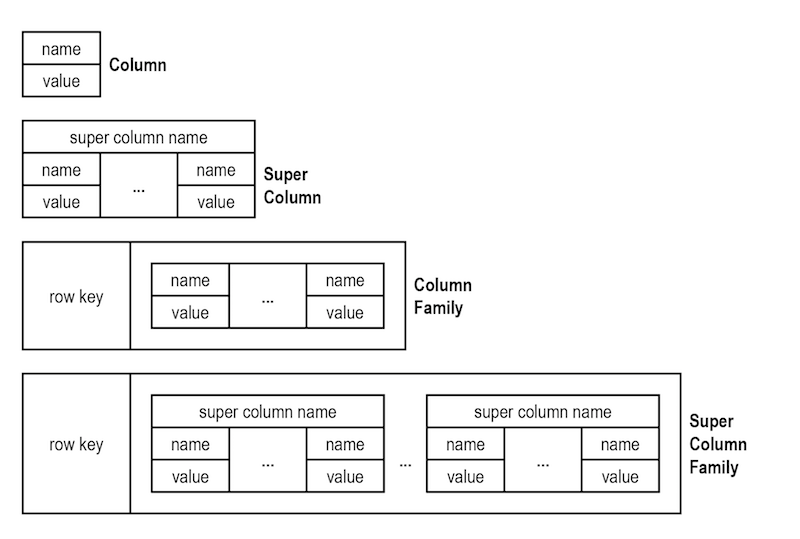

## Introduction

A wide-column store is a type of [NoSQL database](NoSQL). It uses tables, rows, and columns, but unlike a relational database, the names and format of the columns can vary from row to row in the same table. A wide-column store can be interpreted as a two-dimensional key–value store.

Column databases are not relational, they don’t even have what a RDBMS advocate would recognize as tables. The following concepts are critical to understand how column databases work:

- **Column family** is how the data is stored on the disk. All the data in a single column family will sit together. Column family can contain either columns or super columns, it cannot contain both.
- **Super column** can be thought of as a dictionary, it is a column that contains other columns. But it can't contain other super columns.
- **Column** is a tuple of name, value and timestamp

Column oriented databases usually offer one of two forms of queries, by key or by key range. This make sense, since a wide-column database is meant to be distributed, and the key determines where the actual physical data would be located. In column oriented databases it is impossible to query by column value.

### Resources

- RavenDB Mythology Documentation, book by Oren Eini
