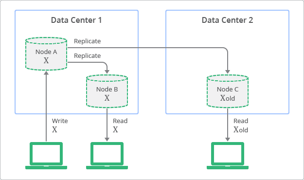

## Introduction

A key value store stores values by key, as simple as that. The value itself is just a blob, as far as the data store is concerned, it just stores it, it doesn’t actually care about the content. We don’t have a data stored defined schema, but a client defined semantics for understanding what the values are. The benefits of using this approach is that it is very simple to build a key value store, and that it is very easy to scale it. It also tend to have great performance, because the access pattern in key value store can be heavily optimized.

In general, most key/value operations can be performed using O(1), regardless of how many machines there are in the data stores and regardless of how much data is stored.

## How are things handled from a developer perspective?

- **Concurrency** is only applicable on a single key, and it is usually offered as either optimistic writes or as eventually consistent.
  - In highly scalable systems, optimistic writes are often not possible, because of the cost of verifying that the value haven’t changed (assuming the value may have replicated to other machines), there for, we usually see either a key master or the eventual consistency model
- In a key value store **query** is performed by the key. Some key/value stores allow range queries on the key, but that is rare.
- While it is possible to offer **transaction** guarantees in a key value store, those are usually only offered in the context of a single key put.
  - It is possible to offer transactions on multiple keys, but it doesn’t work in a distributed key/value store, where different keys may reside on different machines.
- Key/value stores has the following **schema**: Key is a string, Value is a blob. The client is the one that determines how to deal the data.
- In Key Value stores, there are two major options for **scaling**, the simplest one would be to shard the entire key space. That means that keys starting in A go to one server, while keys starting with B go to another server, and so on.
  - In this system, a key is only stored on a single server
  - We get transactions guarantees, the system is exposed to data loss if a single server goes down.
- In key value stores, the **replication** can be done by the store itself or by the client (writing to multiple servers). Replication also introduce the problem of divergent versions. In other words, two servers in the same cluster think that the value of key A are two different things.
  - Resolving that is a complex issue, the common approaches are to decide that it can’t happen and reject updates where we can’t ensure non conflict or to accept all updates and ask the client to resolve them for us at a later date.

## Eventually consistent key/value stores

Eventual consistency means that if a write operation is completed successfully, then eventually all read operations will return the value (assuming that no new write operations were executed in between). However, until this happens, read operations may return previous stale values.

Eventually-consistent services are often classified as providing [BASE](../Theory/BASE) (Basically Available, Soft state, Eventual consistency) semantics.

## Common Usage

Key/Value stores shine when we need to access the data by key. User related data, such as the session or shopping cart information are ideal, because we always know what the user id is. Another common usage is to store pre-compute data based on the primary key. For example, we may want to store all the information about a product (including related products, reviews, etc) in a key/value store based on the product SKU. That allows us to query all the relevant data about a product in an O(1) manner.

Because key based queries are practically free, by structuring our data access along keys, we can get significant performance benefit by structuring our applications to fit that need.

If we need to do things more complex than just access a bucket of bits using a key, we probably need to look at something else.

### Resources

- RavenDB Mythology Documentation, book by Oren Eini
- [Balancing Strong and Eventual Consistency with Datastore](https://cloud.google.com/datastore/docs/articles/balancing-strong-and-eventual-consistency-with-google-cloud-datastore)
