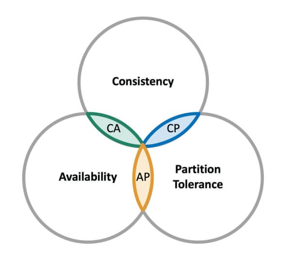

## What is the CAP theorem?

CAP theorem claims that a distributed system can deliver only two of three desired characteristics: consistency, availability, and partition tolerance. It’s essential to understand the CAP theorem when designing a cloud app so that you can choose a data management system that delivers the characteristics your application needs most.

CAP stands for:

- **Consistency** means that all clients see the same data at the same time, no matter which node they connect to. For this to happen, whenever data is written to one node, it must be instantly forwarded or replicated to all the other nodes in the system before the write is deemed successful.
- **Availability** means that that any client making a request for data gets a response, even if one or more nodes are down. All working nodes in the distributed system return a valid response for any request, without exception.
- A partition is a communications break within a distributed system, a lost or temporarily delayed connection between two nodes. **Partition tolerance** means that the cluster must continue to work despite any number of communication breakdowns between nodes in the system.

## Databases in the CAP theorem

CAP theorem classifies databases based on the two CAP characteristics they support:

- A **CP database** delivers consistency and partition tolerance at the expense of availability. When a partition occurs between any two nodes, the system has to shut down the non-consistent node (i.e. make it unavailable) until the partition is resolved.
- An **AP database** delivers availability and partition tolerance at the expense of consistency. When a partition occurs, all nodes remain available but those at the wrong end of a partition might return an older version of data than others. (When the partition is resolved, the AP databases typically resync the nodes to repair all inconsistencies in the system.)
- A **CA database** delivers consistency and availability across all nodes. It can’t do this if there is a partition between any two nodes in the system, however, and therefore can’t deliver fault tolerance. Many [relational databases](../Relational%20databases/Relational-databases) fall into this category.

## CAP theorem criticism

- CAP uses very narrow definitions:

  - Consistency in CAP actually means **linearizability**[^1], which is a very specific notion of consistency. In particular it has got nothing to do with the C in ACID, even though that C also stands for “consistency”.

  - Availability in CAP is defined as “every request received by a non-failing (database) node in the system must result in a (non-error) response”. It’s not sufficient for some node to be able to handle the request: any non-failing node needs to be able to handle it. Many highly available (low downtime) systems do not meet this definition of availability.

  - Partition Tolerance basically means that you’re communicating over an asynchronous network that may delay or drop messages. The internet and all our datacenters have this property, so we don’t have any choice in this matter.

- CAP theorem doesn’t just describe any system, but a very specific model of a system:

  - The CAP system model is a single, read-write register. The CAP theorem says nothing about transactions that touch multiple objects: they are simply out of scope of the theorem, unless you can somehow reduce them down to a single register.

  - The only fault considered by the CAP theorem is a network partition. This is not the only kind of thing that can go wrong: nodes can crash or be rebooted, you can run out of disk space, you can hit a bug in the software, etc. In building distributed systems, you need to consider a much wider range of trade-offs, and focussing too much on the CAP theorem leads to ignoring other important issues.

  - The CAP theorem says nothing about latency, which people tend to care about more than availability. In fact, CAP-available systems are allowed to be arbitrarily slow to respond, and can still be called “available”.

As an alternative to CAP theorem, see [PIE Theorem](./PIE-Theorem)

### Footnotes

[^1] The [formal definition of linearizability](http://cs.brown.edu/~mph/HerlihyW90/p463-herlihy.pdf) (“consistency” in the CAP sense) is not entirely straightforward, but the key idea, stated informally, is this: _If operation B started after operation A successfully completed, then operation B must see the the system in the same state as it was on completion of operation A, or a newer state._

### Resources

- [IBM Cloud Learn Hub - Database](https://www.ibm.com/cloud/learn/database)
- [Please stop calling databases CP or AP](https://martin.kleppmann.com/2015/05/11/please-stop-calling-databases-cp-or-ap.html)
