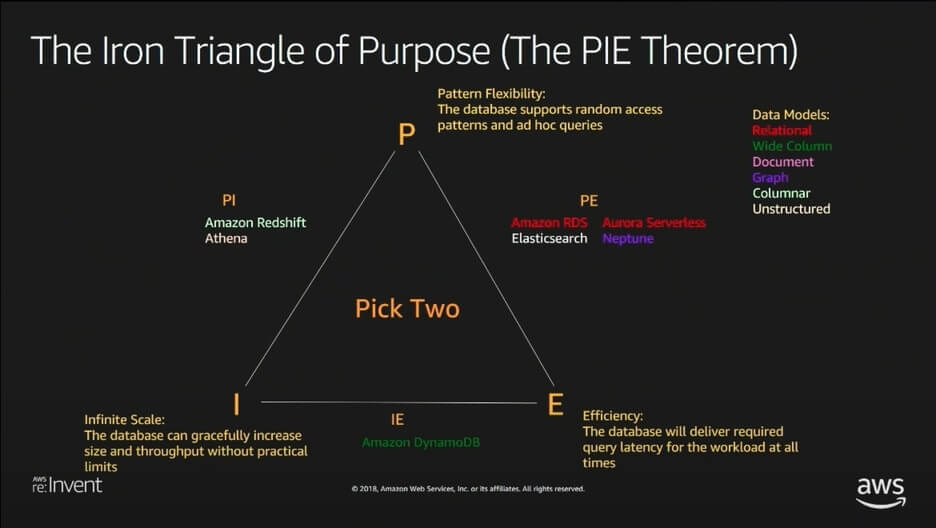

## Introduction

The PIE theorem is a handy way to think about our data needs and choose the right tool for the job. The PIE theorem posits that we can choose two out of three desirable features in a data system:

- **Pattern Flexibility** asks the question do we want the option to ask new, unanticipated questions of our data? For example, maybe we are writing a movie library and originally modeled our movies to be queried by title. A database with pattern flexibility would allow us to easily access by genre or author name in the future, as the requirements change.

- **Efficiency** asks about the basic performance characteristics of our database. Do we need to serve many distinct queries at the same time with response times of under a few hundred milliseconds? If so, efficiency ought to be one of our two choices. If we only need a few concurrent queries and can tolerate latency of seconds or even hours, then efficiency is not a primary concern.

- **Infinite scale** asks how big do we expect our data to grow? More data means more other resources — disk, compute, network, etc. Are we building application with hundreds of millions of users? Or are we building an application that won’t reach millions of users or hundreds of GB of data?

## Databases in the PIE theorem

The PIE Theorem allows three possible permutations (PE, PI, and IE).

- **Pattern Flexibility & Efficency (PE)**
  - Suitable for applications that require reasonably fast reads and writes from multiple clients at the same time, so efficiency is a must.
  - Query flexibility is important as applications often evolve over time as users ask for additional use cases.
  - It is possible to use the same database both for serving on-line queries and for running analytic queries.
  - Relational databases are the most popular option in this category. Database normalization and third normal form is for pattern flexibility.
  - _Examples: Oracle, PostgreSQL, MySQL, Microsoft SQL Server, etc._
- **Infinite Scale & Efficiency (IE)**
  - Under the scale of billions of users, all demanding data as quickly as possible the PE systems began to break down.
  - The problems of PE which the IE solves are impossibility to host all data on a single machine, and inefficient relational JOINs due to the additional I/O and computation required
  - Rather than optimizing for write simplicity and read flexibility, NoSQL emphasized read simplicity. Ourr data should be organized to allow for simple, fast lookups to specific use cases.
  - This denormalized nature made it easier to horizontally shard our data
  - With a denormalized data store, we lose the flexibility of normalization. It’s possible that a new access pattern will require a rewrite of our data. However, by being specific with the access patterns, it is easy to scale our data store to billions of users with consistent, predictable latency.
  - _Examples: MongoDB, Cassandra, HBase, DynamoDB, etc._
- **Pattern Flexibility and Infinite Scale (PI)**
  - Optimal selection when we are willing to give up efficiency. We don’t need sub-second response times or thousands-to-millions of concurrent queries.
  - Data warehouse (powerful PI system) allows us to combine multiple data sources, including production databases, event logs, and various metrics, into a single source of truth.
  - We get back the flexibility of running analytic queries
  - _Examples: Amazon Redshift, Snowflake, SAP HANA, etc._

### Resources

[AWS re:Invent 2018: Building with AWS Databases: Match Your Workload to the Right Database (DAT301)](https://www.youtube.com/watch?v=hwnNbLXN4vA)
